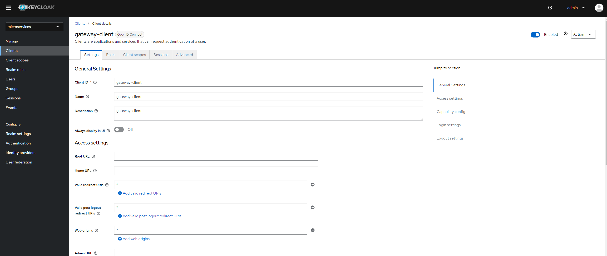
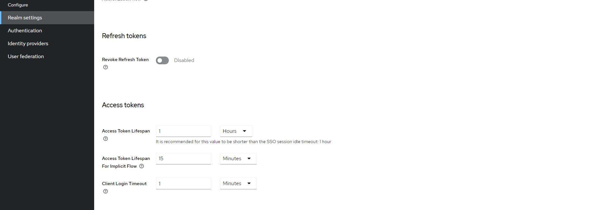
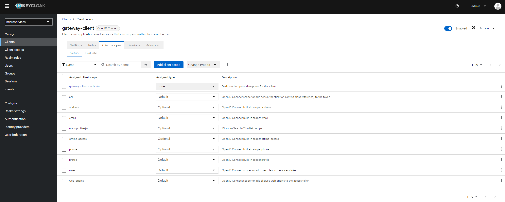

## **Manipulacija s "*redirect_uri*" parametrom**

Ispod je primjer URL za login kada se prijavljuje preko Angular aplikacije u projektu:

`http://host.docker.internal:8080/realms/microservices/protocol/openid-connect/auth?client_id=gateway-client&redirect_uri=http%3A%2F%2Flocalhost%3A4200%2F&state=9ea3c638-ab51-4c20-9e6b-8156a6612e02&response_mode=fragment&response_type=code&scope=openid&nonce=6bbe6da0-c16b-4a77-a319-5fa3435d6aac`

Može se primjetiti da je redirect_uri = "***http%3A%2F%2Flocalhost%3A4200%2F***" tj. "***http://localhost:4200***"

Napadač može kopirati ovaj URL za login, izmijeniti "*redirect_uri"* te ga može poslati korisniku.
Korisnik će vidjeti login zaslon na koji se i inače prijavljuje, ali nakon prijave će biti preusmjeren na zlonamjernu stranicu gdje može unijeti neke osjetljive podatke.

Zaštita za ovaj tip napada se može postaviti u **Keycloak-u** u postavkama klijenta pod "***Valid redirect URIs***".

{width=1167px}

## **Pohrana tokena**

Ako napadač uspije dobiti pristup pohrani podataka od preglednika (npr. zlonamjerna ekstenzija za preglednik), može ukrasti token i koristiti ga kod slanja zahtjeva prema servisu.

### Refresh token

Ako napadač dobije pristup refresh tokenu, može cijelo vrijeme slati zahtjeve prema autentifikacijskom servisu (Keycloak) da im se dodijeli novi token što bi značilo da imaju kontinuirani pristup servisima.

Zaštita za ove napade je sigurna pohrana tokena, te podešavanje vremena trajanja tokena i refresh tokena.

Podešavanje trajanja vremena valjanosti tokena i refresh tokena je moguće u Keycloak-u:

{width=1097px}

# **Scope**

Napadači mogu manipulirati dozvolama kako bi dobili pristup resursima koje ne bi trebali imati. 

Zaštita za ove napade se može definirati u Keycloak-u tako da se ograniči koje *scope-*ove korisnik može zatražiti za kojeg klijenta, te je moguće definirati koji user može pristupiti kojem *scope*\-u.

{width=1132px}
